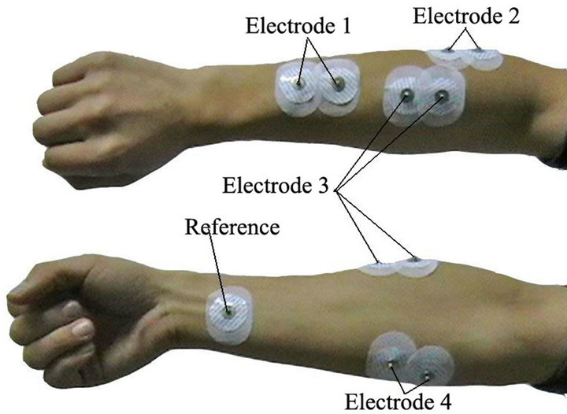

# EMG Signal Classification for Hand/Arm Movements

This project showcases a complete machine learning pipeline for classifying hand and arm movements using EMG (Electromyography) sensor data. The signals are collected from three muscle regions: **biceps**, **triceps**, and **middle finger**.

---

## 📊 Data Preprocessing

* **Missing Values Handling**: Used **KNN Imputer** to fill in missing data.
* **Duplicate Removal**: Removed **9,109 duplicate entries** to ensure data integrity.
* **Exploratory Analysis**: Performed visual analysis using **boxplots** to understand feature distributions and outliers.

---

## 🤖 Machine Learning Models

Implemented and evaluated multiple classification models:

* **Random Forest Classifier**
* **Decision Tree Classifier**
* **Support Vector Machine (SVM) Classifier**

---

## 🔍 Key Features

* **Dataset Overview**:

  * Total Samples: **11,595**
  * After Cleaning: **2,486**

* **Sensor Signals**:

  * From **biceps**, **triceps**, and **middle finger** muscles

* **Evaluation Metrics**:

  * **Accuracy**
  * **Precision**
  * **Recall**
  * **F1-Score**
  * **ROC-AUC**

---

## 🛠 Tech Stack

* **Language**: Python
* **Libraries**:

  * `pandas`
  * `scikit-learn`
  * `matplotlib`
  * `seaborn`
* **Development Environment**: Jupyter Notebook

